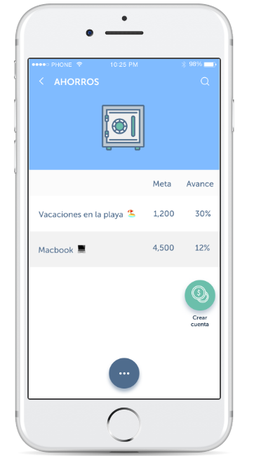

# Aplicación financiera

## Preámbulo

El banco más importante del país ha lanzado una nueva aplicación móvil al
mercado para que sus usuarios puedan visualizar sus gastos mensuales y fomentar
el ahorro. Luego de tener algunos meses en el mercado, el
equipo detrás de este nuevo producto ha decidido contratar a una
agencia/consultora de UX que los ayude a definir la dirección y evolución del
producto. Tú has sido elegida como la consultora líder de UX y se te ha asignado el proyecto para hacer un diagnóstico, evaluar el desempeño de la aplicación y proponer los cambios necesarios para optimizar el producto.

## Introducción

### Contexto

“Perder la salud por ganar dinero y perder el dinero para recuperar la salud”

Paradojas como esta, que nos compartió el Dalai Lama, nos hacen reflexionar, invierto años de mi vida para generar recursos económicos, que después no sabré cómo administrar de manera óptima. 

Para 2025 los millenials representarán el 75% de la fuerza laboral según datos de la UNAM en un estudio realizado en 2015 por lo que fomentar una cultura del ahorro es de vital importancia.

No solo el auto de tus sueños, el viaje a bali que viste en instagram, sino tener la tranquilidad de saber que estás aprendiendo a desarrollar buenos hábitos financieros para el resto de vida.

Y con esto en mente, les presento “Tus Finanzas”;
una aplicación que ayuda a navegar en el incierto mundo del ahorro. Combatiendo las cultura de la inmediatez, fomentando el ahorro como una habilidad para el futuro.

“Tus finanzas”   “el tiempo, nuestra moneda” 
“ahorrar no es sólo guardar, sino saber gastar”
“hoy empieza todo”, “ahorra o nunca”

 te conduce mediante una experiencia intuitiva y orgánica.

Landing page de la nueva app
La propuesta de rediseño fué construída haciendo uso de algunas metologías como:

## Research 

Análisis heurístico de usabilidad

La Data arrojó lo siguiente...

Testing del prototipo
Entrevista con usuarios (interacción constructiva)
Formulario para “Costumer Journey Map”
https://docs.google.com/forms/d/e/1FAIpQLSdDSdD_UqjgVP7Bfm9Wrio4EomclWDkWAzObO08Mf9TIsEUDA/viewform
Entrevista con el cliente
Benchmark
Formulario mapeando el nivel de satisfacción que hay en cada fase del producto
Costumer Journey map
Diagrama de prioridades

How might We
Formulando un User Persona
Rediseñando el prototipo en una segunda iteración, donde los cambios implementados fueron testeados nuevamente por usuarios, para validar si efectivamente están siendo atendidas sus necesidades.

Decir datos espeficios que fueron hallados en alguna de las herramientas. (por lo menos 3)

Lo Cual arrojó los siguientes hallazgos:

Problemas encontrados tanto a nivel de negocio como a nivel de usuario

          NECESIDADES DEL BANCO                                            

Fomentar metas de ahorro, 
facilitar control sobre gastos y movimientos. 
Que atraiga nuevos usuarios 
y se mantenga vigente.  

           NECESIDADES DEL USUARIO

Una herramienta
accesible en términos de usabilidad, intuitiva, 
que lo motive a ahorrar.
 Mantener control de sus gastos y movimientos a detalle.

Análisis de heurística de usabilidad:

1) En el campo “detalle de operaciones” el elemento “Given operation” no resulta tan claro.

2) El campo “Crear cuenta” es ambiguo y se presta a la confusión, piensan que se refiera a crear 
En sección “ahorros” podría mostrar la cantidad que lleva ahorrado, no sólo el porcentaje.

    3)  Control y libertad del usuario:

falta un botón de home, que redirija a la pantalla inicial.

   4)  Consistencia y estándares:

Los usuarios se confunden al respecto del campo “Crear cuenta” , piensan que se trata de una nueva cuenta de bancaria/ahorro. Más no, un nuevo registro de ahorro.

 5) Prevención de errores:

Podría poner de color verde los campos que ya ha sido llenados correctamente y en rojo lo que aún no, de esa manera evitan errores 
NO cuenta con un mecanismo que indique error o lo evite en el futuro

6) Reconocimiento antes que recuerdo:

    a)Necesita micro-interacciones más icónicas que se queden se reconozcan fácilmente.

7) Flexibilidad y eficiencia de uso:

Podría tener una opción de “Crear nueva cuenta de ahorro” desde un principio, para satisfacer las necesidades de los usuarios consolidados dentro de la app.

8) Estética y diseño minimalista:

La tarjeta debería mostrarse en una proporción menor, es muy grande
El detalle de saldo disponible, no mostrase tan evidente, podría mostrarse la cifra con una propiedad  de opacidad y solo visualizar nítidamente cuando la selecciones o pases el cursor

9)  Ayudar a los usuarios a reconocer: 

No cuenta con mensajes de error, debe implementarse feedback claro y de forma positiva para no culpabilizar al usuario, sino guiarlo en el proceso

10) Ayuda y documentación:

No cuenta con documentación, podría ser necesario ofrecer ayuda y documentación. Dicha información debería ser fácil de buscar, estar enfocada en las tareas del usuario, con una lista concreta de pasos a desarrollar y no ser demasiado extensa.
La data ofrece los siguientes hallazgos:

La descargas de Android rebasan las realizadas por IOS 
Las métricas y KPI's a medir
    
## PUNTOS DE DOLOR DE LA APP

Icono de inicio no es amigable, debería ser un logo
Perfil del usuario no muestra información muy relevante 
Identidad de la app no es memorable, no destaca
El detalle de saldo disponible es muy grande y poco discreto
La proporción de la tarjeta es muy invasiva 
No hay una opción de “Home” 
Sección “Crear una cuenta” no expresa claramente de qué se trata
Sección “Ahorros” no muestra la cantidad que lleva ahorrada 
Recomendaciones de próximos pasos para el banco con respecto al app (estas recomendaciones tendrán que ser sustentadas por tu investigación):

Recomendaciones de próximos pasos para el banco con respecto al app (estas recomendaciones tendrán que ser sustentadas por tu investigación):
Qué modificaciones se deberían hacer
Cuáles deberían ser los próximos desarrollos
En qué se debería invertir el presupuesto de marketing (en el desarrollo para android”

Cuáles deberían ser los próximos desarrollos:

## PROPUESTAS DE REDISEÑO:

(priorizar los que solucionan el problema inicial)

Ícono de acuerdo a lo que quiere proyectar la marca 
Los usuarios no recuerdan el nombre de la app
Un nuevo slogan
Antes de pedir número de cuenta, ofrecer un aviso de seguridad
Colocar foto debe ser opcional entre foto o avatar
Redondear sus gastos y lo que sobra, canalizarlo a una cuenta nueva de ahorro en automático
El perfil podría ser más  personalizable, con datos como n* de cuenta, 
Implementar sección de “Mis logros alcanzados” en perfil.
Registro de ahorros por voz
Menú donde muestra perfil de usuario podría tener campo de “metas de ahorro cumplidas” como si fueran medallas y/o insignias. Funcionaran como micro-interacciones que proyectan “triunfo”
Movimientos podría filtrar por tiempo (movimiento mensual, trimestral, semestral)
Gastos podría filtrar pór tiempo ( movimiento mensual, trimestral, semestral)
Ahorro podría mostrar metas de ahorro ya cumplidas a manera de logros/insignias 
El usuario dentro de la app, puede ganar puntos y subir de nivel según sus metas cumplidas.
Diseñar micro-interacciones  más dinámicas y estimulantes para el usuario
Haciendo uso de quotes, se fomenta la práctica del ahorro
Ahorros podría tener opción de:
Ahorro a corto
Ahorro a mediano
Ahorro a largo

En qué se debería invertir el presupuesto de marketing

En la implementación de chatbot de botsociety

Poner insights más completas e importantes

Lo que nos llevó a formular el reto de diseño:

¿Cómo podemos propagar de forma orgánica la cultura del ahorro mediante una app?

 “Lo que había antes/lo que cambió” 

.
 A través de su registro mas claro
La seguridad fue reconfigurada con esto
El detalle de gasto muesta mas
Los pesos redondeados se van a un fondo de ahorro
Haciendo uso de quotes, se fomenta la práctica del ahorro
etc…

### Presentación:
https://docs.google.com/presentation/d/11IlHOdukvoUD5ke-wprjMNnUAT8mInBfXBpfkZV7pnI/edit?usp=sharing

### Link al prototipo navegable:

https://marvelapp.com/5cg5g8i

### Video del prototipo

¿Cuál es su diferenciador? Su valor agregado es ….

Promover una atmósfera lúdica, que acompaña al usuario mientras desarrolla |

### Video de loom: https://www.loom.com/share/3895e308c07745a89b4fbd9807209d08 

Autoria: Karen Ramírez Legorreta

Herramientas: 
- Miro
-  Loom
-  Marvel
- Figma
- Google Form

Agradecimientos:

-  A mi squad por la colaboración y el opoyo mutuo.
-  A mis coach  por el seguimiento
