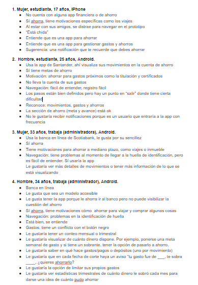
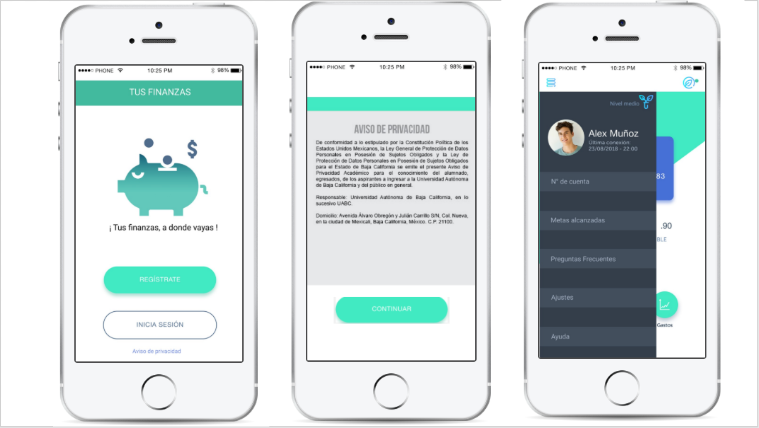

# Aplicación financiera

## Preámbulo

El banco más importante del país ha lanzado una nueva aplicación móvil al
mercado para que sus usuarios puedan visualizar sus gastos mensuales y fomentar
el ahorro. Luego de tener algunos meses en el mercado, el
equipo detrás de este nuevo producto ha decidido contratar a una
agencia/consultora de UX que los ayude a definir la dirección y evolución del
producto. Tú has sido elegida como la consultora líder de UX y se te ha asignado el proyecto para hacer un diagnóstico, evaluar el desempeño de la aplicación y proponer los cambios necesarios para optimizar el producto.

## Objetivos de aprendizaje
El objetivo principal de este proyecto es que te enfrentes al reto de rediseñar un producto ya existente. Muchas de ustedes terminarán trabajando en productos existentes y deben estar familiarizadas con el proceso de analizar la data del producto, complementar con investigación de campo y con esto definir una estrategia de crecimiento del producto. Puedes leer sobre el trabajo de un UX Designer en rediseño este blogpost.

En este proyecto pondrás en práctica habilidades de: análisis de datos, investigación de campo, pensamiento crítico, cuestionamiento, síntesis, diseño de componentes de la interfaz y user testing.

## Objetivos iniciales del proyecto

Someter la aplicación "Tus Finanzas" a un proceso de rediseño, con fundamentos heurísticos y criterios de análisis, para conseguir una experiencia que incentive el ahorro y el pensamiento crítico en los usuarios.
Encontrar los puntos de dolor de la aplicación, para potencializar la experiencia y ganar legitimidad en el mercado. Fidelizar usuarios, mejorar la interfaz en terminos de usabilidad.

## Contexto

Comencemos por delimitar las necesidades de cada involucrado.

         NECESIDADES DEL BANCO                                            

Fomentar metas de ahorro, 
facilitar control sobre gastos y movimientos. 
Que atraiga nuevos usuarios 
y se mantenga vigente.  

           NECESIDADES DEL USUARIO

Una herramienta
accesible en términos de usabilidad, intuitiva, 
que lo motive a ahorrar.
 Mantener control de sus gastos y movimientos a detalle.

## Problemas encontrados tanto a nivel de negocio como a nivel de usuario

A pesar de tener acceso a la información, a una paga semanal o mensual y a productos financieros adaptados a sus necesidades, a los adolescentes les cuesta identificar que sus hábitos de hoy pueden afectar a su vida de mañana. Concienciar a los más jóvenes de la importancia de la educación financiera es todavía una asignatura pendiente.
-  https://www.bbva.com/es/educacion-financiera-adolescentes-asi-gastan-dinero/

El uso de las ciencias del
comportamiento para
aumentar los ahorros
para el retiro en México
-  http://www.ideas42.org/wp-content/uploads/2018/11/I42-1046_MetLifeLatAm_paper_SPA_Final.pdf

Datos sobre"Hábitos de bancarización digital" (Estudio de Citibanamex. Es de 2016, presentado en 2017)

*El celular fue el medio más utilizado por los bancarizados internautas en México, con una penetración del 96%. El internet fijo en casa fue el segundo punto de acceso a internet con el 78% de las respuestas.

-  https://searchdatacenter.techtarget.com/es/cronica/Andres-Vives-el-CDO-tras-la-transformacion-digital-de-Citibanamex

Hábitos de bancarización digital
De acuerdo con el Estudio Brújula Digital 2016 Citibanamex, presentado en febrero de 2017, algunos datos sobre los hábitos de los clientes de Citibanamex indican:

-  El celular fue el medio más utilizado por los bancarizados internautas en México, con una penetración del 96%.
-  El internet fijo en casa fue el segundo punto de acceso a internet con el 78% de las respuestas.

-  El 56% de los encuestados opinó que en el futuro no se usará efectivo y se pagará con el teléfono celular, por lo que se consolidará como el principal medio de pago.

-  El 86% de los bancarizados encuestados tiene un teléfono inteligente o de última generación (smartphone).
-  El uso de las aplicaciones bancarias descargadas en un teléfono celular creció 38% en el último año, pasando de 13% a 18% en comparación con el año anterior.
 
 -  En promedio se utilizaron 12 veces al mes, siendo 2016 el primer año en que las aplicaciones se usan con mayor frecuencia que el servicio de banca por internet.
-  El uso de la banca por internet disminuyó, pasando del 20% al 17%. En promedio, la gente lo utilizó siete veces al mes.
-  Las aplicaciones bancarias destacaron por su rapidez, la comodidad de usarlas desde el teléfono celular o la tablet, la seguridad y la facilidad de uso.

### Problemas encontrados en la Data proporcionada:

Visitas de los usuarios a el Landing Page:
Las vistas en el landing page se realizan mayormente con sistema operativo Android. Por lo que el 61% de las visitas las realizan desde un dispositivo Android.

Después del landing page el acercamiento de la app con los usuarios baja mucho, tan solo el 10% llega al AppStore.

 AppStore:
 En el AppStore solo el 13% instala TUS FINANZAS en su dispositivo
Y solo el 11% ya en la app, se registra 

¿Qué pasa con facebook ads?

Los mecanismos de marketing digital conocidos como Facebook ads no cumplen su misión que es  atraer a posibles usuarios porque de las impresiones tan solo el 1% llega a visitar el Landing Page

### Por lo cual se llegó a los siguientes hallazgos 

## ¿En qué se debería invertir el presupuesto de marketing?

Con base en los hallazgos que fueron encontrados despues de analizar la Data, se recomienda destinar ese presupuesto a desarrollar la versión disponible para Android

### Para continuar con el proceso de análisis integral de la interfaz, utilicé las siguientes metodologías

          

## Análisis heurístico de usabilidad:

1) En el campo “detalle de operaciones” el elemento “Given operation” no resulta tan claro.

2) El campo “Crear cuenta” es ambiguo y se presta a la confusión, piensan que se refiera a crear 
En sección “ahorros” podría mostrar la cantidad que lleva ahorrado, no sólo el porcentaje.

    3)  Control y libertad del usuario:

falta un botón de home, que redirija a la pantalla inicial.

   4)  Consistencia y estándares:

Los usuarios se confunden al respecto del campo “Crear cuenta” , piensan que se trata de una nueva cuenta de bancaria/ahorro. Más no, un nuevo registro de ahorro.

 5) Prevención de errores:

Podría poner de color verde los campos que ya ha sido llenados correctamente y en rojo lo que aún no, de esa manera evitan errores 
NO cuenta con un mecanismo que indique error o lo evite en el futuro

6) Reconocimiento antes que recuerdo:

    a)Necesita micro-interacciones más icónicas que se queden se reconozcan fácilmente.

7) Flexibilidad y eficiencia de uso:

Podría tener una opción de “Crear nueva cuenta de ahorro” desde un principio, para satisfacer las necesidades de los usuarios consolidados dentro de la app.

8) Estética y diseño minimalista:

La tarjeta debería mostrarse en una proporción menor, es muy grande
El detalle de saldo disponible, no mostrase tan evidente, podría mostrarse la cifra con una propiedad  de opacidad y solo visualizar nítidamente cuando la selecciones o pases el cursor

9)  Ayudar a los usuarios a reconocer: 

No cuenta con mensajes de error, debe implementarse feedback claro y de forma positiva para no culpabilizar al usuario, sino guiarlo en el proceso

10) Ayuda y documentación:

No cuenta con documentación, podría ser necesario ofrecer ayuda y documentación. Dicha información debería ser fácil de buscar, estar enfocada en las tareas del usuario, con una lista concreta de pasos a desarrollar y no ser demasiado extensa.

    
## PUNTOS DE DOLOR DE LA APP

Icono de inicio no es amigable, debería ser un logo
Perfil del usuario no muestra información muy relevante 
Identidad de la app no es memorable, no destaca
El detalle de saldo disponible es muy grande y poco discreto
La proporción de la tarjeta es muy invasiva 
No hay una opción de “Home” 
Sección “Crear una cuenta” no expresa claramente de qué se trata
Sección “Ahorros” no muestra la cantidad que lleva ahorrada 

## Testing con usuarios

### Guía de entrevista a usuarios:
-  https://docs.google.com/document/d/1BZX9FWGuJl0zoMVyrltwY7VSfiXdhc-Xs5zw6YjnHoQ/edit?usp=sharing

### Entrevista en loom con usuaria, cuentahabiente.
- Violeta Nosquist
-  28 años
-  Profesora de Historia
-  Usa Banca Movil 
-  Ahorra para viajar, su salud y amueblar su departamento

Link a la entrevista de video en Loom:
-  https://www.loom.com/share/879abe2e4a4c43cbb50d6693e2fcc2b2

### Entrevistas de audio a los usuarios que testearon el prototipo:

-  Patricia  https://soundcloud.com/karen-ramirez-403538963/1entrevista

-  Gustavo administrador https://soundcloud.com/karen-ramirez-403538963/2entrevista

-  Estudiante 25 años (hombre) https://soundcloud.com/karen-ramirez-403538963/3entrevista

-  Estudiante 17 años (mujer)
https://soundcloud.com/karen-ramirez-403538963/5entrevista

-  Diseñadora 32 años https://soundcloud.com/karen-ramirez-403538963/4entrevista

### Pruebas de usabilidad con 33 usuarios:

-  https://docs.google.com/spreadsheets/d/1qo3hnonAI40pyBbfMc6P6FUEV3EaCDAB_zE3vpA7-II/edit#gid=0

### Pruebas de usabilidad con usuarios que se ajustan el target:

-  https://docs.google.com/document/d/1BB9xcInGMEyGl6o7ebY5G93Tm18DyMZvH6Tg5UNcZRo/edit
Cuáles deberían ser los próximos desarrollos:

## Costumer Journey Map

Para poder testear el prototipo de manera remota además de personal, se realizó un formulario para mapear el nivel de satisfacción de los usuarios en cada fase del prototipo, con lo cual se podrá implementar la metodología "Costumer Journey Map".

 Formulario para “Costumer Journey Map”
-  https://docs.google.com/forms/d/e/1FAIpQLSdDSdD_UqjgVP7Bfm9Wrio4EomclWDkWAzObO08Mf9TIsEUDA/viewform

 

 El formulario aportó valiosa información que perimitió mapear la satisfacción todas las etapas de la usabilidad

Confianza 

## Benchmark 

Análisis de Benchmark:

Benchmark - mejores app de control de gastos:

-  Tus finanzas (todo se hace manualmente)
-  Monefy ()
-  moneyWiz(predicciones, estadísticas)
-  zaveapp (redondeo se traduce a ahorro)
-  Fintonic ()
-  Organizze
-  Qapital (deja que definas reglas , puedes redondear y eso se ahorra, cuesta tres niveles de membresía, entre mas nivel se muestra más ahorro) Mejore basados en tus metas 
-  Acorns(redondea tus compras al siguiente dólar y automáticamente agrega tu ahorro en un portafolio según tus metas, después de una transacción con empresa partner como air bnb , regresan un % de la compra) inversión es el mejor
-  Digit (calcula lo que podrías ahorrar basado en tus ingresos, según patrones de gastos y transfiere la cantidad desde cru cuenta en una cuenta de seguros digit, tiene 2 o 3 ahorros por semana) cuenta. es las más intuitiva y simple
-  Chime (mejor como banco alternativo, es un mobile only bank, por usar la app podría tomas una cuenta de cheques y una tarjeta de débito o de ahorros, gratis , se puede redirigir automáticamente el 105 de tu pago a una cuenta de ahorro por una comisión)

### User persona 

Analizando el usuario primario y secundario se llegó a la conlcución de que no tenía concordancia con el target y se formuló un tercer User persona cuya descripción tuviera mas congruencia con el target

 

## Insights 

### How might We?

Lo que nos llevó a formular el reto de diseño:

¿Cómo podemos propagar de forma orgánica la cultura del ahorro mediante una app?

## Sketch

El skecth anterior se testeó con 6 usuarios y ofrecieron más opciones para l aimplementación, que se ven reflejadas en el prototipo de alta fidelidad 

## PROPUESTAS DE REDISEÑO:

(priorizar los que solucionan el problema inicial)

-  Ícono de acuerdo a lo que quiere proyectar la marca 
Los usuarios no recuerdan el nombre de la app
-  Un nuevo slogan
-  Antes de pedir número de cuenta, ofrecer un aviso de seguridad
-  Colocar foto debe ser opcional entre foto o avatar
-  Redondear sus gastos y lo que sobra, canalizarlo a una cuenta nueva de ahorro en automático
-  El perfil podría ser más  personalizable, con datos como n* de cuenta, 
-  Implementar sección de “Mis logros alcanzados” en perfil.
-- Registro de ahorros por voz
-  Menú donde muestra perfil de usuario podría tener campo de “metas de ahorro cumplidas” como si fueran medallas y/o insignias. 
-  Funcionaran como micro-interacciones que proyectan “triunfo”
-  Movimientos podría filtrar por tiempo (movimiento mensual, trimestral, semestral)
-  Gastos podría filtrar pór tiempo ( movimiento mensual, trimestral, semestral)
-  Ahorro podría mostrar metas de ahorro ya cumplidas a manera de logros/insignias 
-  El usuario dentro de la app, puede ganar puntos y subir de nivel según sus metas cumplidas.
-  Diseñar micro-interacciones  más dinámicas y estimulantes para el usuario
-  Haciendo uso de quotes, se fomenta la práctica del ahorro
-  Ahorros podría tener opción de:
- Ahorro a corto
- Ahorro a mediano
- Ahorro a largo
-  A través de su registro mas claro
-  La seguridad fue reconfigurada con esto
-  El detalle de gasto muesta mas discretamnete 
-  Los pesos redondeados se van a un fondo de ahorro
-  Haciendo uso de quotes, se fomenta la práctica del ahorro

 “Lo que había antes/lo que cambió” 

Se pensó en un concepto para mostrar frescura a la nueva imagen y se implementaron iconos de "plantas" que simulan metaforicamente el crecimiento de tu ahorro como parte de la experiencia lúdica 

Lo enterior fue testeado con 4 usuarios que les agradadó, pero sugieren que sea mas uniforme en los colores.

### En qué se debería invertir el presupuesto de marketing

En el desarrollo para Android
En la implementación de chatbot de botsociety

### Presentación de la Demo del producto final en el siguiente link:
-  https://docs.google.com/presentation/d/11IlHOdukvoUD5ke-wprjMNnUAT8mInBfXBpfkZV7pnI/edit?usp=sharing

## Guión storytelling para la Demo Final:

“Perder la salud por ganar dinero y perder el dinero para recuperar la salud”

Paradojas como esta, que nos compartió el Dalai Lama, nos hacen reflexionar, invierto años de mi vida para generar recursos económicos, que después no sabré cómo administrar de manera óptima. 

Para 2025 los millenials representarán el 75% de la fuerza laboral según datos de la UNAM en un estudio realizado en 2015 por lo que fomentar una cultura del ahorro es de vital importancia.

No solo el auto de tus sueños, el viaje a bali que viste en instagram, sino tener la tranquilidad de saber que estás aprendiendo a desarrollar buenos hábitos financieros para el resto de vida.

Y con esto en mente, les presento “Tus Finanzas”;
una aplicación que ayuda a navegar en el incierto mundo del ahorro. Combatiendo las cultura de la inmediatez, fomentando el ahorro como una habilidad para el futuro.

“Tus finanzas”   “el tiempo, nuestra moneda” 
“ahorrar no es sólo guardar, sino saber gastar”
“hoy empieza todo”, “ahorra o nunca”

 te conduce mediante una experiencia intuitiva y orgánica.

Landing page de la nueva app
La propuesta de rediseño fué construída haciendo uso de algunas metologías como... 

## Link de Zeplin, InVision inspects o Marvel Hand-offs para compartir tus diseños con desarrolladores
### Link al prototipo navegable desarrollado en Figma, pero prototipoado en Marvel:

-  https://marvelapp.com/5cg5g8i

### Video del prototipo en Marvel:
Se utilizó el siguiente video para mostrar el flujo de la aplicación durante la Demo Final del producto , frente a los Diseñadores de experiencia de Bancomer
-  https://www.loom.com/share/a87bfc25afb24ba0af28996ff4621197

### Diagrama de flujo de la solución propuesta 

### Video de loom hablando a detalle sobre el proceso de rediseño de la aplicación: 
-  https://www.loom.com/share/3895e308c07745a89b4fbd9807209d08 

## ¿Cuál es su diferenciador? Su valor agregado es ….

Promover una atmósfera lúdica, que acompaña al usuario mientras desarrolla mejores hábitos de ahorro que lo acompañarán a futuro.

Autoria: Karen Ramírez Legorreta

Herramientas: 
- Miro
-  Loom
-  Marvel
- Figma
- Google Form

Agradecimientos:

-  A mi squad por la colaboración y el opoyo mutuo.
-  A mis coach  por el seguimiento y conceptos ofrecidos. 
